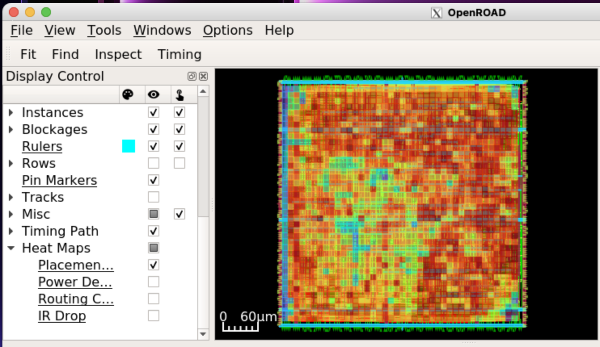
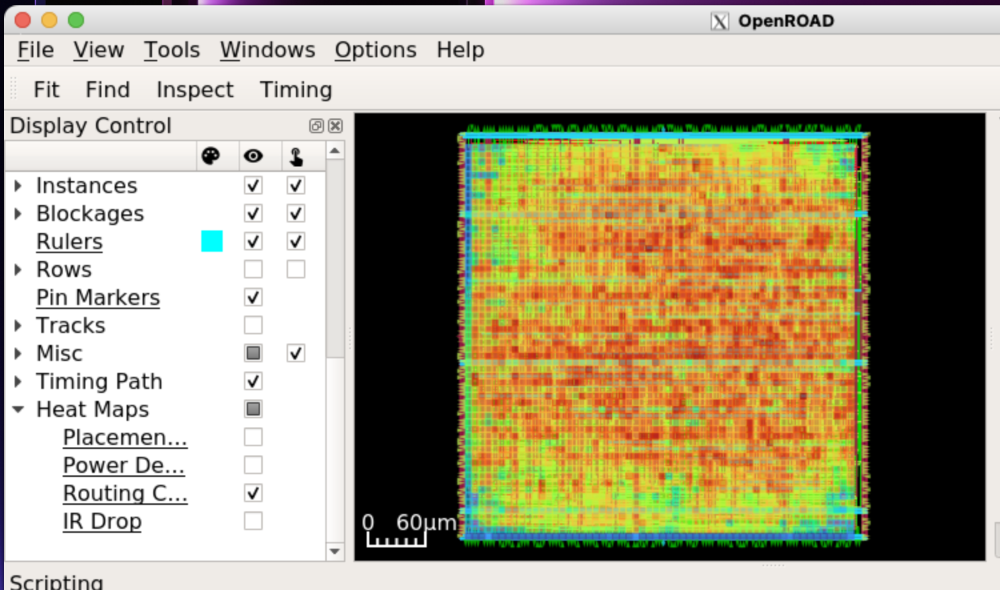
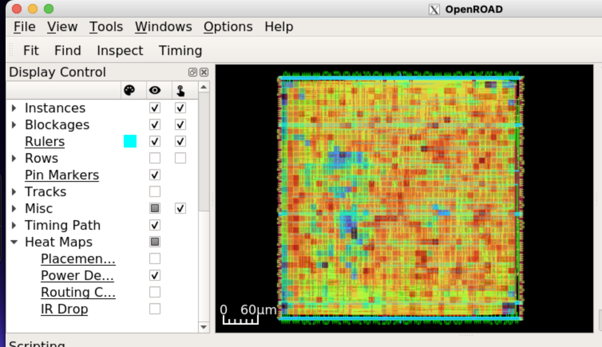
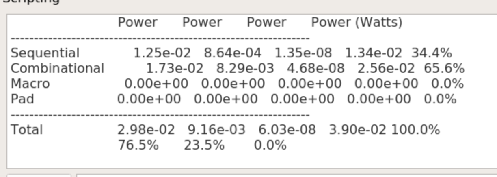

  

## 1. Project Overview
This repository documents the RTL-to-GDSII physical implementation of the **PicoRV32**, a CPU core implementing the RISC-V RV32I instruction set. The design targets the **SkyWater 130nm (Sky130)** process node using the OpenLane flow.

The project focuses on **Sign-off Quality Closure**, achieving timing convergence at **6ns (166 MHz)** while maintaining robust power integrity (IR Drop < 40mV) and high logic density.

### Key Implementation Specs
* **Clock Period:** 6.00 ns (166 MHz)
* **Core Area:** 117,629 $\mu m^2$
* **Standard Cell Count:** 9,743 cells
* **Utilization:** 75%
* **Technology:** SkyWater 130nm (Open Source PDK)

---

## 2. Directory Structure
```text
├── src/
│   ├── picorv32.v          # Verilog Source (RV32I Core)
│   ├── config.tcl          # OpenLane Configuration
│   └── picorv32.sdc        # Custom Timing Constraints
├── results/
│   ├── picorv32.gds        # Final GDSII Database
│   ├── picorv32.lef        # Library Exchange Format (LEF)
│   ├── picorv32.def        # Design Exchange Format (DEF)
│   ├── drc.rpt             # Design Rule Check Report
│   └── timing.log          # Static Timing Analysis Logs
└── docs/
    ├── layout/             # Physical Implementation images
    │   ├── placement_heatmap.png  # Placement Congestion
    │   └── routing_heatmap.png    # Routing Congestion
    └── signoff/            # Power & Integrity images
        ├── IR_drop_report.png     # Static IR Drop Report
        ├── power_density_heatmap.png # Power Density Map
        └── power_report.png       # Total Power Consumption

```
## 3. Post-Route Performance Metrics
The design achieved timing closure without any hold violations, ensuring functional correctness at the target frequency.

| Metric | Value | Unit | Status |
| :--- | :--- | :--- | :--- |
| **Setup Slack** | **+0.82** | ns | **MET** (Timing Clean) |
| **Hold Slack** | **+0.18** | ns | **MET** (No Hold Violations) |
| **Max Clock Freq** | 166 | MHz | Target Met |
| **Total Power** | 39.0 | mW | @ 0.1 Activity Factor |
| **Core Utilization** | 75 | % | High Density |
| **Worst IR Drop** | **0.039** | V | **SAFE** (< 2% of VDD) |

---

## 4. Congestion & Density Analysis
Placement density was analyzed to identify hotspots. Despite high utilization (75%), routing congestion was managed effectively, resulting in a DRC-clean layout.

| Placement Density | Routing Congestion |
| :---: | :---: |
|  |  |
| *Heatmap: Logic cell distribution* | *Heatmap: Metal layer utilization* |

---

## 5. Power Integrity & Sign-off
A full Power Distribution Network (PDN) analysis was conducted to ensure signal integrity. The **Static IR Drop** is significantly below the 5% limit typical for 1.8V domains.

### Power Density Analysis
| Power Map | Voltage Drop Report |
| :---: | :---: |
|  |  |
| *High activity regions (Red)* | *Worst Case Drop: 39.1 mV* |

### Final Power Consumption
**Total Power Estimate (Internal + Switching + Leakage):**

